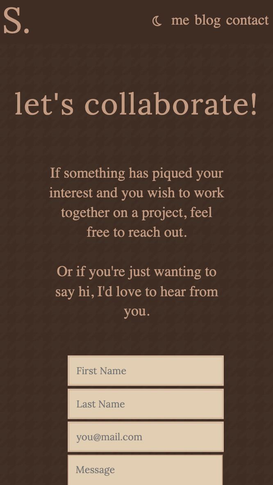

# Portfolio Website 

#### Relevant External Links:
- ##### Website Deployment: [Sarah Landis Portfolio](https://sarahlandis.netlify.app/)
- ##### GitHub Repository: [Sarah Landis Portfolio](https://github.com/sarahhlandis/Sarah-Landis-Portfolio)
- ##### Video Walkthru: [Video Walkthru](/docs/Sarah%20Landis%20Porfolio%20Walkthru.mp4)

### Purpose: 
The purpose of this website is to show off some HTML and CSS skills that I've learned. This website is meant to serve as my functioning portfolio - I figure it will be an infinite process so I recommend to keep an eye out for any modifications and refinements. The goal is to showcase some cool Vanilla CSS effects and clean HTML organization in order to attract employers and developers to either want to work with me or inspire them to create something even better.
### Functionality:
 - #### Features
    - My portfolio site features a simple but effective nightmode function using a small amount Javascript code. I've chosen to implement a nightmode option for general usability - I always have my electronic devices on nightmode with a warm yellow hue so I thought - why not build one into my site? This element speaks to my personal character and thought process in how I would create for a client...thinking of their target audience and how to better elevate their experience on my site.
    - Media queries assisting with responsiveness to better enable a functional UI and boost the UX across a range of electronic devices. A responsive layout is ultra important in today's world with the high rate of phones being attached to hands and people using tablets on the go, so this was important for me to consider whilst creating this webpage. 
    - Users have the ability to browse some recent projects I've been working on in my freetime as well as notable employer/brand work. This is a functional element I incorporated because it allows employers to gain better perspective about how I code, the end result, and the inbetween stages. I intend this section to be my opportunity to showcase my best work as I gain more experience. Note: these are currently set up as mock blocks, however they will become filled as I complete more projects.
    - Interactive hyperlinks to my social media pages including GitHub and LinkedIn - currently I have left Instagram out for privacy reasons however the icon is still present on the site as a demonstration. As mentioned above, with the digital age now effecting our bone evolution (yes, I'm talking about the dreaded neck hump!), it's safe to say it's important to link my users to my professional accounts in case they wish to see more.
    - CSS vanilla effects including an animated 'fade-in' for main headers and some content. My site also features a few button and hover effects. Most of these are purely aesthetic sprinkles, mainly to demonstrate my unique and personal style.
    - The site includes a link to my resumé for employer accessibility and convenience. The resumé opens up in a new tab so as not to lose user traffic by diverting from or interrupting the page the user is on. I felt this was especially important because the user may want both tabs up at once to flick between and I didn't want to inconvenience them with extra navigating.
    - Some standout textual CSS elements that aid in the functionality such as, but not limited to:
        1. the navigation bar at the top which stays fixed across all pages;
        2. the footer at the bottom of the page which also stays fixed across all pages and includes styled links;
        3. the blog small navigation carousel that when clicked, brings up the relevant blog in full view;
        4. the connect page layout featuring 3 columns of text, broken apart via an animation and themed styles
    - Some standout graphical CSS elements that aid in the visual aesthetic such as, but not limited to: 
        1. the project tiles with photos and box shadow + small translate animation;
        2. the main gallery layout of the blog featuring photos and an opaque background for easier reading;
        3. the styled resumé button which opens a new tab with my resumé;
        4. animations that effect both text and images throughout the side further exuding a refined aesthetic
    - An active blog where users can peruse my writings on relevant social and/or professional topics. I incorporated this element so that anyone who visits my site can get a taste for my writing, my perspective on life, my humor, and my ability to write.
 - #### Target Audience: 
My target audience are those who are seeking to learn more about me and my work. I hope to demonstrate a bit about my character through my site, from the overall design aesthetic to the curation of all the element positioning and overall organization. I hope employers will get the sense that I have a clean work ethic, with a focus on functionality and concision. I hope web developers will see the creativity in my code and reach out with any suggestions on refactoring or improved usability.

### Sitemap: 

Please see above for this site's sitemap, created with Drawio. As pictured, the site features a home button (return to main) option in both the header and footer allowing easy navigation between the pages. Me, Blog, and Contact are the three main header links which are displayed on all pages. Projects and Connect are only accesible from the home page, as well as the social links via icons.

### Implementation:
- I have implemented media queries at 350px, 720px and 1200px to accomodate for users on different types of electronic devices. Below are some screenshots of how these pages would look across the various devices.
    - Mobile View - iPhone SE (375x677)
    
    
    
    
    
    
    - Tablet View - iPad Mini 8.3 (744x1133)
     
    
    
    
    
    
    - Desktop View - Macbook Pro 14" (1512x982)
    
    
    
    
    
    

- I have also integrated a night mode function as denoted by the moon icon in the navigation bar. Please see below photos of the color scheme. Note: The layout does not change in nightmode, only the colors.
    
    
    
    
    
    

### Tech Stack: 
- HTML
- CSS/SCSS
- JS (single element)
- Google Chrome Dev Tools
- Figma Wireframing
- Drawio Sitemap
- Netlify Deployment

##### Sources Used:
- ###### Font Awesome - Social Media Icons
- ###### Hero Patterns for the background houndstooth print
- ###### All images sourced from Unsplash (free usage under Unsplash copyright)